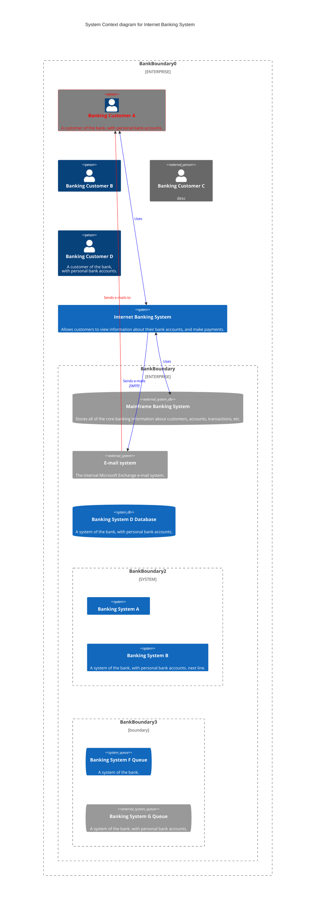

# app-doc-template

During the heat of the project and pressing deadlines we don't always have the time it takes to produce documentation for the future. Contributing to the problem is that we may not always know or agree what kind of documentation there should be and this ambiguity leads us to produce insufficient and unhelpful or even no documentation at all.

This document aims to provide simple but yet sufficient template to help you produce application documentation that covers at least the most crucial pieces of information.

To clarify the goal let's explain to whom and for what purpose we want to produce the documentation using this template. In the order of importance:
- Developers  
Developers are the main audience of the application document. Most importantly the document should enable smoother on-boarding and efficient introduction to the application. All the critical information on how to develop, maintain and troubleshoot the application should be documented.
- Architects  
Documentation should provide the architects with adequate high level overview of the application. 

## Solution architecture

Solution architecture describes high level architecture of the solution. It gives reader a quick overview of what are the related systems and their responsibilities and what are the main business functionalities provided by the solution.

### System context diagram

System context diagram shows the system in scope and its relationship with users and other systems.

# Deployment architecture

Where is this shit running?

# Developer documentation

## Crucial links

Links to app running in different envs

## Releasing

How to release? How to do hot fix?

### CI setup

